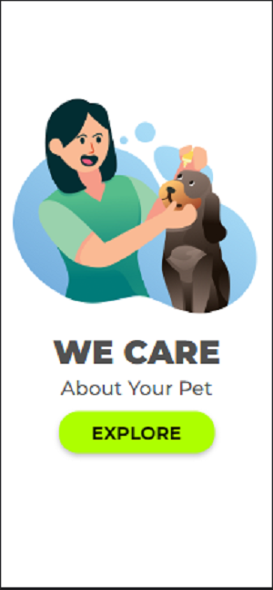
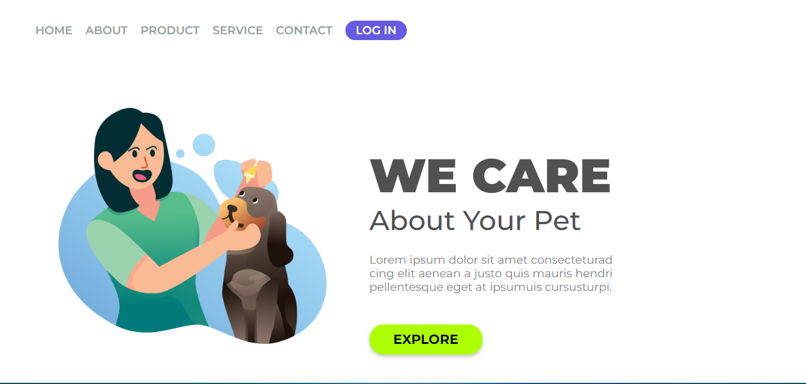

# :point_right:Projeto de tela de login

Projeto desenvolvido no curso <a href="https://rodolfomori.com.br/devclub/">DevClub</a> proposto como um desfio. O projeto é uma tela de login de cuidados para animais e foi desenvolvido para ser responsivo para vários aparelhos, desde computador até celular.

 

<h2>Resultados do projeto:</h2>

<h1 align="left">

</h1>
 
 
<h2>Tecnologias Utilizadas:</h2>
 

 
 
 
<h2>O que foi desenvolvido:</h2>

- [x] Tela responsiva para computador e celular
- [ ] Desenvolvido para tablet

<h2>Envolvidos no projeto:</h2>

<table>
  <tr>
    <td align="center">
      <a href="https://github.com/gGtEriKk">
         
        
          <b>Erik Gomes</b>
        
      </a>    
</table>
